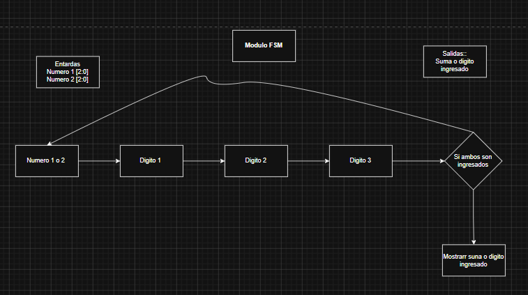
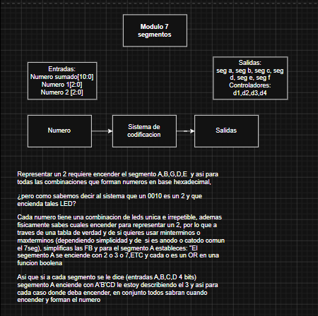
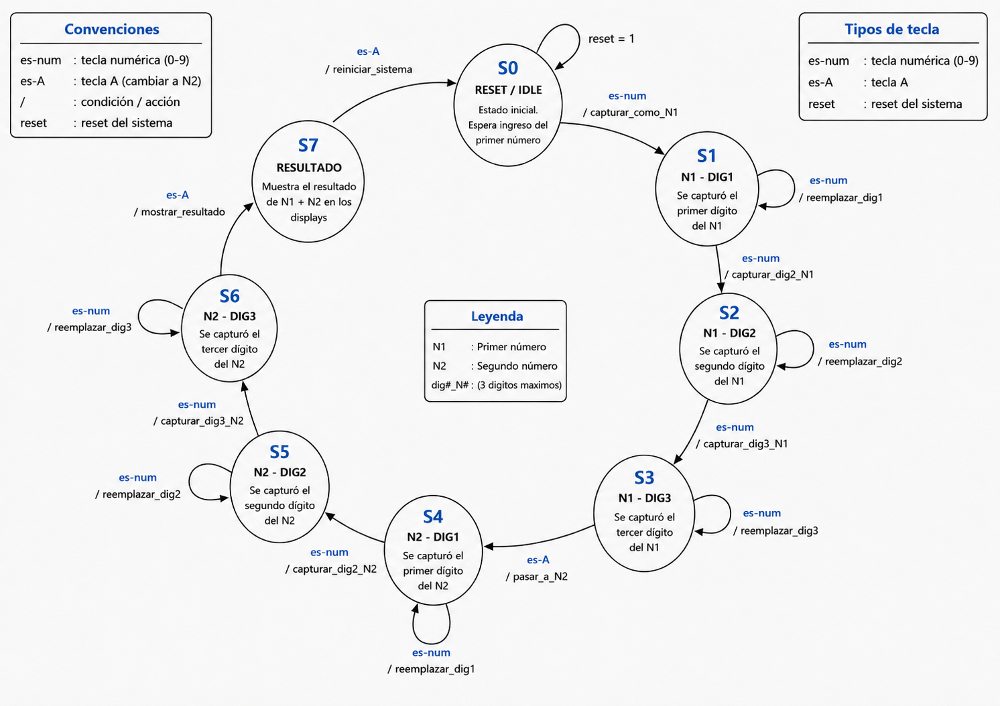

# Proyecto 2
# Sistema de ingreso por teclado matricial hexadecimal

## 1. Abreviaturas y definiciones
- **FPGA**: Field Programmable Gate Arrays

## 2. Referencias
[0] David Harris y Sarah Harris. *Digital Design and Computer Architecture. RISC-V Edition.* Morgan Kaufmann, 2022. ISBN: 978-0-12-820064-3

[1] Fairchild Semiconductor, “DM74LS163A Synchronous 4-Bit Binary Counters,” Datasheet, 2000.

[2] Datasheet Hub, “74LS163 Fully Synchronous 4-Bit Counter,” 2023. [Online]. Available: https://www.datasheethub.com/74ls163-fully-synchronous-4-bit-counter/

[3] ON Semiconductor, “74LS163 Binary Counter Datasheet,” Datasheet, 2004.

[4] C. Garaipoom, “SR Latch Explained: Circuit Variants, Truth Table, and Operation,” ElecCircuit, Feb. 2026. [Online]. Available: https://www.eleccircuit.com/how-sr-latch-works/

[5] “SR Latch Circuit,” ChipVerify. [Online]. Available: https://www.chipverify.com/digital-fundamentals/sr-latch-circuit

[6] SR NAND latch,” Electronics-Course. [Online]. Available: https://electronics-course.com/sr-nand-latch


## 3. Funcionamiento general del circuito

El sistema diseñado corresponde a una calculadora básica de suma implementada en hardware digital. La entrada de datos se realiza mediante un teclado hexadecimal 4x4, el cual es escaneado por columnas para determinar la tecla presionada. Debido a que las señales del teclado pueden presentar rebotes mecánicos, se incluye una etapa de filtrado que genera un único pulso limpio por cada pulsación estable.

La lógica principal se controla mediante una máquina de estados finitos. Esta FSM permite ingresar dos números decimales de hasta tres dígitos, utilizando la tecla `A` como señal de confirmación. Los dígitos ingresados se almacenan como centenas, decenas y unidades, y posteriormente se convierten a su valor binario equivalente. Una vez ingresados ambos números, el sistema calcula la suma y permanece mostrando el resultado hasta que se reinicie el circuito.

Para visualizar la información, el resultado binario se convierte a BCD mediante restas sucesivas. Los cuatro dígitos BCD obtenidos se envían a un controlador de display multiplexado, el cual activa secuencialmente cada dígito del display de siete segmentos. El sistema utiliza displays de cátodo común, por lo que los segmentos se encienden con nivel lógico alto.

El sistema completo se organiza en varios módulos: escaneo del teclado, eliminación de rebotes, control por FSM, conversión binario a BCD y control del display.

---
## Diagrama de bloques del sistema (etapas tempranas previas a consulta a profesor)
#### Scanner


#### Modulo debounce


#### Modulo FSM


#### Sumador


#### Modulo 7segmentos


## Diagrama de transiciones de estados de la FSM de datos


## Diagrama de transiciones de estados de la FSM de conversion binario a decimal binario para representacion


---

### 1. Módulo principal: `top`

```systemverilog
module top (
    input  logic clk,
    input  logic reset,
    input  logic [3:0] filas,
    output logic [3:0] columnas,
    output logic [3:0] anodos,
    output logic [6:0] siete_seg,
    output logic led_externo_contacto,
    output logic led_externo_pulso,
    output logic led_externo_bit0
);
```

#### Descripción

Este módulo conecta todos los bloques del sistema. Recibe el reloj principal, el reset físico y las señales provenientes de las filas del teclado matricial. A partir de esas entradas controla las columnas del teclado, procesa la tecla presionada, almacena los números ingresados, calcula la suma y envía los valores correspondientes al display de siete segmentos.

El reset externo del sistema es activo en bajo, por eso dentro del módulo se invierte mediante:

```systemverilog
assign rst_high = ~reset;
```

De esta forma, los módulos internos trabajan con un reset activo en alto.

#### Entradas

| Señal        | Descripción                                               |
| ------------ | --------------------------------------------------------- |
| `clk`        | Reloj principal del sistema.                              |
| `reset`      | Reset físico activo en bajo.                              |
| `filas[3:0]` | Entradas provenientes de las filas del teclado matricial. |

#### Salidas

| Señal                  | Descripción                                                                       |
| ---------------------- | --------------------------------------------------------------------------------- |
| `columnas[3:0]`        | Señales de activación de columnas del teclado.                                    |
| `anodos[3:0]`          | Control de los cuatro dígitos del display. Activo en 1 para los transistores NPN. |
| `siete_seg[6:0]`       | Salidas hacia los segmentos del display. Cátodo común, segmentos activos en 1.    |
| `led_externo_contacto` | LED de depuración asociado a detección física de tecla.                           |
| `led_externo_pulso`    | LED de depuración asociado al pulso limpio del debounce.                          |
| `led_externo_bit0`     | LED de depuración asociado al bit menos significativo de la tecla procesada.      |

#### Funcionamiento general

El sistema primero escanea el teclado mediante el módulo `scanner`. Cuando se detecta una tecla, el valor pasa al módulo `debounce`, el cual genera un único pulso limpio por cada pulsación válida. Ese pulso se entrega a la FSM, la cual decide si la tecla corresponde a un dígito decimal o a la tecla `A`, usada como confirmación o enter.

Mientras se ingresa el primer número, el display muestra sus dígitos. Luego de presionar `A`, el sistema pasa a recibir el segundo número. Después de confirmar el segundo número con `A`, se muestra el resultado de la suma.

La selección de qué se muestra en el display se hace con:

```systemverilog
assign {v4, v3, v2, v1} = (s_est == 4'd8) ? {res_m, res_c, res_d, res_u} :
                          (s_est <  4'd4) ? {4'hF, c1, d1, u1} :
                                             {4'hF, c2, d2, u2};
```

Esto significa:

* Si la FSM está en estado de resultado, se muestra la suma.
* Si la FSM está en los estados del primer número, se muestra `n1`.
* Si la FSM está en los estados del segundo número, se muestra `n2`.
* El dígito izquierdo se deja apagado al ingresar números de tres dígitos.

---

### 2. Módulo `scanner`

```systemverilog
module scanner (
    input logic clk,
    input logic reset,
    input logic stop_scanning,
    input logic [3:0] filas,
    output logic [3:0] columnas,
    output logic tecla_detectada,
    output logic [3:0] pos_tecla
);
```

#### Descripción

Este módulo se encarga de leer el teclado matricial 4x4. Para hacerlo, activa una columna a la vez y observa el valor presente en las filas. Si alguna fila cambia de `1` a `0`, significa que una tecla fue presionada.

El teclado trabaja con resistencias de pull-up, por lo que el estado normal de las filas es `1111`. Cuando una tecla se presiona, una fila queda conectada con una columna activa en bajo.

#### Entradas

| Señal           | Descripción                                           |
| --------------- | ----------------------------------------------------- |
| `clk`           | Reloj principal.                                      |
| `reset`         | Reset activo en alto.                                 |
| `stop_scanning` | Detiene el barrido mientras una tecla está detectada. |
| `filas[3:0]`    | Entradas físicas del teclado.                         |

#### Salidas

| Señal             | Descripción                               |
| ----------------- | ----------------------------------------- |
| `columnas[3:0]`   | Columnas activadas secuencialmente.       |
| `tecla_detectada` | Indica que existe una tecla presionada.   |
| `pos_tecla[3:0]`  | Código hexadecimal de la tecla detectada. |

#### Funcionamiento

El módulo genera un divisor de reloj con `div_clk`. Cada vez que el contador llega a `26999`, cambia la columna activa. Las columnas se activan en bajo:

```systemverilog
2'b00: columnas = 4'b1110;
2'b01: columnas = 4'b1101;
2'b10: columnas = 4'b1011;
2'b11: columnas = 4'b0111;
```

Luego, el módulo combina columnas y filas para identificar la tecla:

```systemverilog
case ({columnas, filas})
```

Por ejemplo:

```systemverilog
8'b1110_1110: pos_tecla = 4'h1;
8'b1101_0111: pos_tecla = 4'h0;
8'b0111_1110: pos_tecla = 4'hA;
```

La tecla `A` se usa como enter dentro de la FSM.

Una vez identifica la tecla y bajo la idea de que tecla no prescionada es 4'b1111
```systemverilog
 if (filas != 4'b1111) begin
            tecla_detectada = 1'b1;
            case ({columnas, filas})
                8'b1110_1110: pos_tecla = 4'h1; 
                8'b1110_1101: pos_tecla = 4'h4; 
                8'b1110_1011: pos_tecla = 4'h7; 
                8'b1110_0111: pos_tecla = 4'hE; // *
```
Entra en el case para detectaar cual tecla fue prescionada apoyado en el rastreo y asignacion de teclas


---


### 3. Módulo `debounce`

```systemverilog
module debounce #(parameter N = 21) (
    input  logic clk,
    input  logic rst,
    input  logic valido,
    input  logic [3:0] tecla,
    output logic limpio,
    output logic [3:0] seleccion
);
```

#### Descripción

Este módulo elimina los rebotes mecánicos del teclado. Una tecla física no cambia de estado de forma ideal, sino que puede generar varios cambios rápidos antes de estabilizarse. El módulo evita que esos rebotes sean interpretados como varias pulsaciones.

#### Entradas

| Señal        | Descripción                              |
| ------------ | ---------------------------------------- |
| `clk`        | Reloj del sistema.                       |
| `rst`        | Reset activo en alto.                    |
| `valido`     | Indica que el scanner detectó una tecla. |
| `tecla[3:0]` | Valor de la tecla detectada.             |

#### Salidas

| Señal            | Descripción                                              |
| ---------------- | -------------------------------------------------------- |
| `limpio`         | Pulso limpio de un solo ciclo cuando la tecla es válida. |
| `seleccion[3:0]` | Tecla estable filtrada.                                  |

#### Funcionamiento

Primero se sincronizan las entradas `valido` y `tecla` para evitar problemas por señales asíncronas. Luego se agrupan ambas en una sola muestra:

```systemverilog
assign muestra_actual = {valido_s2, tecla_s2};
```

Si la muestra cambia, el contador se reinicia. Si la muestra permanece igual durante suficiente tiempo, se considera estable. Cuando la tecla está estable y el sistema está armado, se genera un único pulso:

```systemverilog
if (estable && muestra_anterior[4] && armado) begin
    seleccion <= muestra_anterior[3:0];
    limpio    <= 1'b1;
    armado    <= 1'b0;
end
```

El sistema no vuelve a generar otro pulso hasta que la tecla se libere de forma estable.


---

### 4. Módulo `FSM_control`

```systemverilog
module FSM_control (
    input  logic clk,
    input  logic reset,
    input  logic pulse_tecla,
    input  logic [3:0] pos_tecla,

    output logic [13:0] n1_bin,
    output logic [13:0] n2_bin,
    output logic [13:0] suma,
    output logic [3:0] estado_vis,

    output logic [3:0] c1_o, d1_o, u1_o,
    output logic [3:0] c2_o, d2_o, u2_o
);
```

#### Descripción

Este módulo es el núcleo de control del sistema. Implementa una máquina de estados finitos que administra la entrada de dos números decimales de hasta tres dígitos. También calcula el valor binario de cada número y la suma de ambos.

#### Entradas

| Señal            | Descripción                            |
| ---------------- | -------------------------------------- |
| `clk`            | Reloj principal.                       |
| `reset`          | Reset activo en alto.                  |
| `pulse_tecla`    | Pulso limpio generado por el debounce. |
| `pos_tecla[3:0]` | Código de la tecla presionada.         |

#### Salidas

| Señal                  | Descripción                                  |
| ---------------------- | -------------------------------------------- |
| `n1_bin[13:0]`         | Primer número convertido a binario.          |
| `n2_bin[13:0]`         | Segundo número convertido a binario.         |
| `suma[13:0]`           | Resultado de `n1_bin + n2_bin`.              |
| `estado_vis[3:0]`      | Estado actual de la FSM.                     |
| `c1_o`, `d1_o`, `u1_o` | Centena, decena y unidad del primer número.  |
| `c2_o`, `d2_o`, `u2_o` | Centena, decena y unidad del segundo número. |

## Estados

| Estado        | Función                                             |
| ------------- | --------------------------------------------------- |
| `S_N1_D1`     | Espera el primer dígito del número 1.               |
| `S_N1_D2`     | Espera el segundo dígito del número 1 o tecla A.      |
| `S_N1_D3`     | Espera el tercer dígito del número 1 o tecla A.       |
| `S_N1_ENTER`  | Espera confirmación con `A` para pasar al número 2. |
| `S_N2_D1`     | Espera el primer dígito del número 2.               |
| `S_N2_D2`     | Espera el segundo dígito del número 2 o tecla A.      |
| `S_N2_D3`     | Espera el tercer dígito del número 2 o tecla A.       |
| `S_N2_ENTER`  | Espera confirmación con `A` para mostrar resultado. |
| `S_RESULTADO` | Muestra el resultado de la suma.                    |

## Funcionamiento

La FSM acepta únicamente teclas del `0` al `9` como dígitos válidos. Esto se controla con la función:

```systemverilog
function automatic logic es_digito(input logic [3:0] tecla);
```

La tecla `A` se interpreta como enter:

```systemverilog
es_enter = (tecla == 4'hA);
```

Cada vez que se ingresa un dígito, los registros se desplazan:

```systemverilog
c1 <= d1;
d1 <= u1;
u1 <= pos_tecla;
```

Esto permite formar números de hasta tres dígitos. Por ejemplo, si se ingresan `1`, `2`, `3`, los registros quedan:

```text
c1 = 1
d1 = 2
u1 = 3
```

Luego se calcula el valor decimal en binario con:

```systemverilog
dec3_to_bin = c*100 + d*10 + u;
```

Finalmente, la suma se obtiene de forma combinacional:

```systemverilog
assign suma = n1_bin + n2_bin;
```

Cuando la FSM llega a `S_RESULTADO`, permanece en ese estado hasta que se aplique reset físico.

Aqui un ejemplo de la codificacion de estados
```systemverilog

                    // Número 1
                    // -------------------------
                    S_N1_D1: begin
                        if (es_digito(pos_tecla)) begin
                            c1 <= d1;
                            d1 <= u1;
                            u1 <= pos_tecla;
                            state <= S_N1_D2;
                        end
                    end

                    S_N1_D2: begin
                        if (es_digito(pos_tecla)) begin
                            c1 <= d1;
                            d1 <= u1;
                            u1 <= pos_tecla;
                            state <= S_N1_D3;
                        end else if (es_enter(pos_tecla)) begin
                            state <= S_N2_D1;
                        end
                    end
```
El sistema verifica que sea una de 0-9 antes de registrarla y luego busca saber cual es para registrarla en la posicion que corresponda segun descrito en el estado, sea centena, decena u unidades.
La estructura se repite a  lo largo de los demas estados solo cambiando detalles menores 

---

### 5. Módulo `bin_to_bcd`

```systemverilog
module bin_to_bcd (
    input  logic clk,
    input  logic reset,
    input  logic [10:0] binario,
    output logic [3:0] millar,
    output logic [3:0] centena,
    output logic [3:0] decena,
    output logic [3:0] unidad
);
```

#### Descripción

Este módulo convierte el resultado binario de la suma a formato BCD para poder mostrarlo en el display de siete segmentos.

Como cada número ingresado puede llegar hasta `999`, la suma máxima posible es:

```text
999 + 999 = 1998
```

Por eso la entrada esperada es de 11 bits, suficiente para representar valores entre `0` y `1998`.

#### Entradas

| Señal           | Descripción                   |
| --------------- | ----------------------------- |
| `clk`           | Reloj principal.              |
| `reset`         | Reset activo en alto.         |
| `binario[10:0]` | Resultado binario de la suma. |

#### Salidas

| Señal          | Descripción         |
| -------------- | ------------------- |
| `millar[3:0]`  | Dígito de millares. |
| `centena[3:0]` | Dígito de centenas. |
| `decena[3:0]`  | Dígito de decenas.  |
| `unidad[3:0]`  | Dígito de unidades. |

#### Funcionamiento

El módulo usa una FSM interna para convertir el número mediante restas sucesivas.

Primero carga el valor binario en `temp`. Luego resta:

* `1000` para obtener millares.
* `100` para obtener centenas.
* `10` para obtener decenas.
* Lo restante corresponde a unidades.

Los estados principales son:

| Estado      | Función                                 |
| ----------- | --------------------------------------- |
| `S_IDLE`    | Espera un cambio en la entrada binaria. |
| `S_INIT`    | Inicializa registros de trabajo.        |
| `S_MILLAR`  | Calcula el dígito de millar.            |
| `S_CENTENA` | Calcula el dígito de centena.           |
| `S_DECENA`  | Calcula el dígito de decena.            |
| `S_UNIDAD`  | Asigna el dígito de unidad.             |
| `S_DONE`    | Actualiza las salidas.                  |

---

### 6. Módulo `controlador_display_total`

```systemverilog
module controlador_display_total (
    input  logic clk,
    input  logic reset,
    input  logic [3:0] val1,
    input  logic [3:0] val2,
    input  logic [3:0] val3,
    input  logic [3:0] val4,
    output logic [3:0] anodos,
    output logic [6:0] siete_seg
);
```

#### Descripción

Este módulo controla un display de siete segmentos de cuatro dígitos mediante multiplexado. Como las líneas de segmentos son compartidas, el sistema enciende un dígito a la vez a alta velocidad, dando la apariencia visual de que todos están encendidos simultáneamente.

#### Entradas

| Señal       | Descripción                         |
| ----------- | ----------------------------------- |
| `clk`       | Reloj principal.                    |
| `reset`     | Reset activo en alto.               |
| `val1[3:0]` | Valor del display derecho.          |
| `val2[3:0]` | Valor del display centro-derecha.   |
| `val3[3:0]` | Valor del display centro-izquierda. |
| `val4[3:0]` | Valor del display izquierdo.        |

#### Salidas

| Señal            | Descripción                              |
| ---------------- | ---------------------------------------- |
| `anodos[3:0]`    | Selección del dígito activo.             |
| `siete_seg[6:0]` | Señales hacia los segmentos del display. |

#### Funcionamiento

El módulo usa un divisor de reloj para cambiar de dígito aproximadamente cada 27000 ciclos de reloj:

```systemverilog
if (clk_div == 16'd26999)
```

El selector `sel` determina cuál dígito está activo:

```systemverilog
2'b00: anodos = 4'b1000; num_actual = val1;
2'b01: anodos = 4'b0100; num_actual = val2;
2'b10: anodos = 4'b0010; num_actual = val3;
2'b11: anodos = 4'b0001; num_actual = val4;
```

Durante una pequeña parte del ciclo, los anodos se apagan para reducir el efecto fantasma entre dígitos:

```systemverilog
if (clk_div < 500) begin
    anodos = 4'b0000;
    num_actual = 4'hF;
end
```

El display se maneja como cátodo común, por lo que un `1` enciende el segmento correspondiente.
```systemverilog
// Cátodo común: 1 enciende el segmento.
    always_comb begin
        case (num_actual)
            4'h0: seg_temp = 7'b0111111;
            4'h1: seg_temp = 7'b0000110;
            4'h2: seg_temp = 7'b1011011;
            4'h3: seg_temp = 7'b1001111;
            4'h4: seg_temp = 7'b1100110;
            4'h5: seg_temp = 7'b1101101;
            4'h6: seg_temp = 7'b1111101;
            4'h7: seg_temp = 7'b0000111;
```
Seleccionando cual segmento encender a traves de las descripciones binarias de cada uno

---

### 7. Flujo completo del sistema

El funcionamiento completo puede resumirse así:

```text
Teclado físico
    ↓
scanner
    ↓
debounce
    ↓
FSM_control
    ↓
bin_to_bcd
    ↓
controlador_display_total
    ↓
Display de siete segmentos
```

El usuario ingresa el primer número usando las teclas numéricas. Luego presiona `A` para confirmar. Después ingresa el segundo número y vuelve a presionar `A`. En ese momento, la FSM pasa al estado de resultado y el display muestra la suma.

Ejemplo de operación:

```text
Ingresar: 1 2 3
Presionar: A
Ingresar: 4 5 6
Presionar: A

Resultado mostrado: 0579
```

Como el display tiene cuatro dígitos, el resultado puede mostrarse desde `0000` hasta `1998`.

---


---

## 4. Ejercicios

En este apartado, se realizarán dos ejercicios sobre dos circuitos, el primero es sobre contadores sincrónicos y el segundo es un cerrojo Set-Reset con compuertas NAND.


### Contadores sincrónicos
 El 74LS163 es un contador cargable sincrónico de 4 bits, con un reset sincrónico. Entonces se toma la siguiente imagen para armar el circuito:


<p align="center">

</p>
<p align="center">
Fig 1. Contadores sincrónicos en cascada.
</p>

Lo primero que se hará es una simulación en multisim para verificar cual es la respueta que se está buscando y cual es el comportamiento de las ondas, para luego compararlo con la respuesta final obtenida en el osciloscopio.

#### Simulación

En la siguiente imagen, se muestra como se implemento el circuito en multisim: 

<p align="center">

</p>
<p align="center">
Fig 2. Circuito de contadores sincrónicos en cascada en multisim.
</p>

En est caso se usa unos modelos de 74LS163 que no son necesarios conectarlos una fuente de alimentación y tierra para más comodidad en el simulador, como también poner el reloj en $1\mathrm{kHz}$
(en práctica si debe tomar en cuenta). El primer canal D0, tomará la señal del reloj, el segundo canal D1 sería la salida de QD del primer 74LS163, el tercer canal D2 sería la salida del QD del segundo 74LS163 y el cuarto canal D3 sería RCO del primer 74LS163. En la siguiente imagen se obtiene el resultado obtenido de la simulación:

<p align="center">

</p>
<p align="center">
Fig 3. Resultado del circuito de contadores sincrónicos en cascada en multisim.
</p>

Luego se explicará porque estos comportamientos son coherentes y es lo que se está buscando.

#### Resultado obtenido en el Osciloscopio.

En la siguiente imagen se muestra lo que se obtuvo oscilospocio, donde los canales son los mismos que utilizaron en la simulación:

<p align="center">

</p>
<p align="center">
Fig 4. Resultado obtenido del osciloscopio del circuito de contadores sincrónicos en cascada.
</p>

En la señal del Reloj (D0) es una onda cuadrada periodica que está aproximadamente de $1.79\mathrm{MHz}$, un valor cercano al que estaba solicitando.

La señal de salida QD del primer contador (D1), presenta una frencuancia de $114.3\mathrm{kHz}$. Cumple con el funcionamiento del 74LS163, ya que cada salida divide progresivamente la frecuencia de entrada entre potencias de dos [1].

$$
f = \frac{f_{CLK}}{16}
$$ 

$$
f = \frac{1.79\mathrm{MHz}}{16}
$$ 

$$
f = 112\mathrm{kHz}
$$

Cercano al valor obtenido en el osciloscopio.

La señal de salida de QD del segundo contador (D2) es más lenta que del primer contador, esto se debe porque este contador va a incremnetar cuando el primer contador alcance $1111_2$ y la señal RCO habilite la entrada T, por lo que el segundo contador divide nuevamente la frecuencia, produciendo una señal considerablemente más lenta [1].

Por último la señal RCO del primer contador (D3), tiene pulsos estrechos, porque se debe que se actica cuando el contador alcance $1111_2$ y las entradas de habilitación estén activas [1]. El 74LS163 incorpora lógica de carry look-ahead, que permite implementar conteos síncronicos de alta velocidad y evitando retardos acumulativos [1].

La razón de porque el RCO y T están conectados entre los dos contadores es para implementar una conexión en cascada entres ambos dipositivos [1]. Una expliación de como funciona que el primer contador incrementa su valor con cada flanco positivo del reloj, cuando alcanza $1111_2$, la salida RCO se activa, por lo habilita temporalmente la entrada T del segundo contador y en el siguinete flanco positivo del reloj, en el segundo contador imcrementa.

Si observamos la hoja de datos del 74LS163, tiene 2 entradas que serían T (ENT) y P (ENP) [1]. Lo que realiza la entreda P es habilitar el conteo interno del contador, para que eso pase debe estar en un nivel alto [2]. Para la entrada E que aparte de hablitar el conteo, también controla la generación de la señal RCO y por está razón se utiliza para la conexión en cascada entre los dos contadores [1].

Para saber que uno de los flip-flops cambie, luego de un flanco positivo del reloj correponde al tiempo de propagación entre el flanco positivo del reloj y el cambio de estados de las salidas Q [1]. En la hoja de datos del 74LS163, su tiempo de progación del reloj es de una aproximación de $14\mathrm{ns}$ [1]. Este retardo se se puede debe a capacitacias parásitas, frecuancia de operción y carga conectada al circuito [3].

Por ultimo, se debe tomar la importacia de cuál bit de salida se escoja para el osciloscopio, porque cada una posee una frecuencia distinta, en la hoja de datos dice que QD es la frecuencia más baja [1]. Por eso en este caso si utliza QD para facilitar la observación temporal de la señales.

#### Error en RCO del contador menos significativo

Se muestra el error que se encuentra en la salida del RCO tanto con el analizador lógico y de manera analógica:

<p align="center">

</p>
<p align="center">
Fig 5. Error en RCO del contador menos significativo en el analizador lógico.
</p>

Como era de esperarse, no se observa los picos o deformaciones del RCO (D3) debido que EN el analizador lógico solo interpreta niveles digitales y no puede capturar pulsos extremadamente cortos.

<p align="center">

</p>
<p align="center">
Fig 6. Error en RCO del contador menos significativo de manera analógica.
</p>

De manera analógica, se pueden obsevar los glitches de la salida RCO, esto se debe a los retardos de propagación internos del circuito, pero se no logró identificar un glitch definido. El 74LS163 es un contador síncrono, pero sus flip-flops y compuertas lógicas no ocurren al mismo tiempo, porque cada elemento interno tiene un tiempo de propagación finito, por tanto en unos nano segundos aparezcan estados transitorios por momentos [1]. La salida RCO depende de varios bits del contador interno y las señales de habilitación de T y P. A la hora del cambio de bits a $1111_2$ a $0000_2$, generan combinaciones temporales incorrectas debido a las diferencias en los tiempos de propagación [1].

#### Video de prueba del uso de la FPGA:

https://youtu.be/u1_UUCeDtsI

### Cerrojo Set-Reset con compuertas NAND 

Este circuito corresponde un cerrojo SR sincronizado mendiante una señal de reloj y constituido con compuestas NAND. Este tipo de circuitos secuenciales tiene la capacidad de almacenar un bit de información utilizando realimentación entre las compuertas lógicas [4]. Se divide en dos etapas: 1. Habilitación mediante reloj. 2. Etapa de memoria.

En la etapa de habilitación de reloj esta conformada por 2 NAND que recibe las señales de entradas S R y el reloj (CLK), sus salidas se pueden definir:

$$
X = (S \cdot CLK)'
$$

$$
Y = (R \cdot CLK)'
$$

En el caso que reloj este en bajo las salidas tomarán un valor alto, entonces el latch se bloequea y conserva el estado almacenado previamente sin importar los cambios de las entradas S y R [5]. En el  caso que el reloj este en alto, las entradas pueden modificar el estado del lacth [5].

En la etapa de memoria también hay 2 compuertas NAND están conectadas en  realimentación cruzada:

$$
Q = (X \cdot Q)'
$$

$$
\overline{Q}  = (Y \cdot Q)'
$$

Esta realimentación permite que el circuito conserve el último estado almacenado aun cuando las entradas regresen a cero [5]. 

Si está en el caso que $S = 1$ , $R = 0$ y $CLK = 1$, es el estado de SET por lo que $Q = 1$ y $\overline{Q} = 0$.

Si está en el caso que $S = 0$ , $R = 0$ y $CLK = 1$, es el estado de HOLD por lo que $Q = 1$ y $\overline{Q} = 0$. Donde las salidas mantienen el mismo valor previo.

Si está en el caso que $S = 0$ , $R = 1$ y $CLK = 1$, es el estado de RESET por lo que $Q = 0$ y $\overline{Q} = 1$.

Si está en el caso que $S = 1$ , $R = 1$ y $CLK = 1$, es el estado de inválido por lo que $Q = 1$ y $\overline{Q} = 1$. Se concidera inválido porque puede generar resultados impredecibles por los retardos internos de propagación [6]. 

Su tabla de verdad es la siguiente:

<p align="center">
Tabla 1. Tabla de verdad del cerrojo.
</p>

<p align="center">

</p>

Se toma la siguiente imagen para armar el circuito:

<p align="center">

</p>
<p align="center">
Fig 7. Circuito de prueba de un cerrojo SR.
</p>

Se hará lo mismo que el ejericio anterior, una simulación en multisim para verificar cual es la respueta que se está buscando y cual es el comportamiento de las ondas, para luego compararlo con la respuesta final obtenida en el osciloscopio y también ver si cumple con la teoría antes establecida.

#### Simulación

En la siguiente imagen, se mostrar como se implemento el circuito en multisim: 

<p align="center">

</p>
<p align="center">
Fig 8. Circuito de prueba de un cerrojo SR en multisim. 
</p>

En este caso en el simulador se está utilizando un 74LS00D al no tener un 74CHOO en el simulador, sin embargo es una opción alternativa al tener las mismas funciones. También se utiliza un reloj en $1\mathrm{kHz}$ para más comodidad. El primer canal D0 tomará la señal del reloj, el segundo canal D1 tomará la señal de $S$, el tercer canal D2 será $R$, el cuarto canal D3 sera la salida de $Q$ y el quinto canal D4 será la salida de $\overline{Q}$. 

En la siguientes imagenes se observarán los resultados de cada caso en la simulación:

Caso $S = 1$ y $R = 0$:

<p align="center">

</p>
<p align="center">
Fig 9. Resultado de la simulación del cerrojo de S = 1 y R = 0.
</p>


Caso $S = 0$ y $R = 0$:

<p align="center">

</p>
<p align="center">
Fig 10. Resultado de la simulación del cerrojo de S = 0 y R = 0.
</p>


Caso $S = 0$ y $R = 1$:

<p align="center">

</p>
<p align="center">
Fig 11. Resultado de la simulación del cerrojo de S = 0 y R = 1.
</p>


Caso $S = 1$ y $R = 1$:

<p align="center">

</p>
<p align="center">
Fig 12. Resultado de la simulación del cerrojo de S = 1 y R = 1.
</p>

#### Resultado obtenido en el Osciloscopio.

En la siguienteS imagenes se muestra lo que se obtuvo oscilospocio, donde los canales son los mismos que utilizaron en la simulación:

Caso $S = 1$ y $R = 0$:

<p align="center">

</p>
<p align="center">
Fig 13. Resultado del osciloscopio del cerrojo de S = 1 y R = 0.
</p>


Caso $S = 0$ y $R = 0$:

<p align="center">

</p>
<p align="center">
Fig 14. Resultado del osciloscopio del cerrojo de S = 0 y R = 0.
</p>

Caso $S = 0$ y $R = 1$:

<p align="center">
 
</p>
<p align="center">
Fig 15. Resultado del osciloscopio del cerrojo de S = 0 y R = 1.
</p>

Caso $S = 1$ y $R = 1$:

<p align="center">

</p>
<p align="center">
Fig 16. Resultado del osciloscopio del cerrojo de S = 1 y R = 1.
</p>

Como puede observar los resultados cumplen lo establecido anteriormente y también es similar a lo obtenido en la simulación.

#### Circuito

<p align="center">

</p>
<p align="center">
Fig 17. Diagrama del cricuito cerrojo SR.
</p>


#### Utilidades del cerrojo

Este circuito puede ser utilizado en:

- Almacemanineto temporal de un bit de información.
- Eliminación de rebotes pulsadores (debouncer).
- Sincronización de señales digitales.
- Construcción de flip-flops complejos.
- Diseños de registros y memorias.


#### Video de prueba del uso de la FPGA:

https://youtu.be/HzC8ifVztvk


## 5. Problemas encontrados durante el proyecto

Uno de los problemas principales fue entender que el teclado no entrega directamente el valor de la tecla. El teclado solo conecta una fila con una columna, por lo que fue necesario implementar un scanner que active columnas y revise filas.

También se tuvo dificultad con las capturas repetidas. Si se usa directamente la señal del scanner, una sola pulsación puede entrar varias veces. Para resolver esto se agregó un módulo que genera un solo pulso válido por tecla.

Otro punto delicado fue la FSM. El sistema debe saber si el dígito ingresado pertenece al primer número o al segundo. Para eso se utilizó una tecla de control, como `A`, que cambia el estado del sistema.

La captura de tres dígitos también necesitó cuidado. El número no se puede guardar como teclas separadas sin procesar, sino que debe construirse con la operación `numero * 10 + digito`.

En el módulo superior, el problema más común fue conectar señales equivocadas. Por ejemplo, usar la tecla cruda en lugar de la tecla validada puede hacer que el sistema detecte la tecla pero la almacene mal.

## 6. Consumo de recursos 

### Estadísticas de síntesis del módulo `top`

| Recurso | Cantidad |
|---|---:|
| Number of wires | 1168 |
| Number of wire bits | 2278 |
| Number of public wires | 1168 |
| Number of public wire bits | 2278 |
| Number of memories | 0 |
| Number of memory bits | 0 |
| Number of processes | 0 |
| Number of cells | 1487 |

### Desglose de celdas

| Celda | Cantidad |
|---|---:|
| ALU | 151 |
| DFFC | 44 |
| DFFCE | 130 |
| DFFP | 1 |
| DFFPE | 1 |
| GND | 1 |
| IBUF | 6 |
| LUT1 | 337 |
| LUT2 | 162 |
| LUT3 | 74 |
| LUT4 | 240 |
| MUX2_LUT5 | 199 |
| MUX2_LUT6 | 78 |
| MUX2_LUT7 | 33 |
| MUX2_LUT8 | 11 |
| OBUF | 18 |
| VCC | 1 |