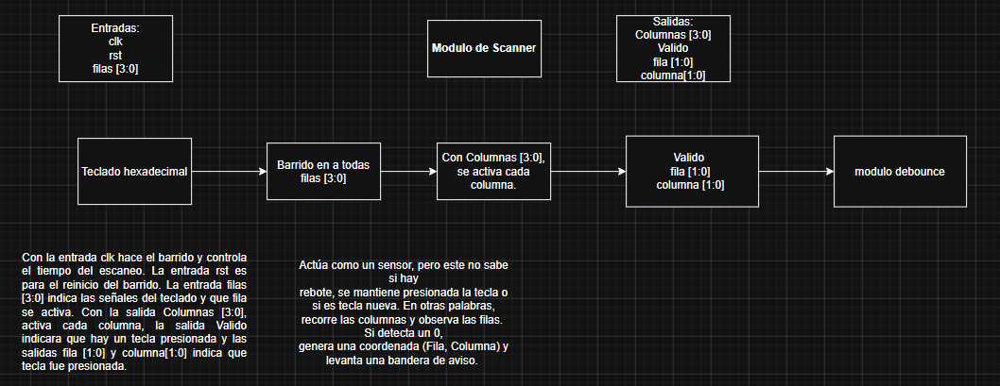
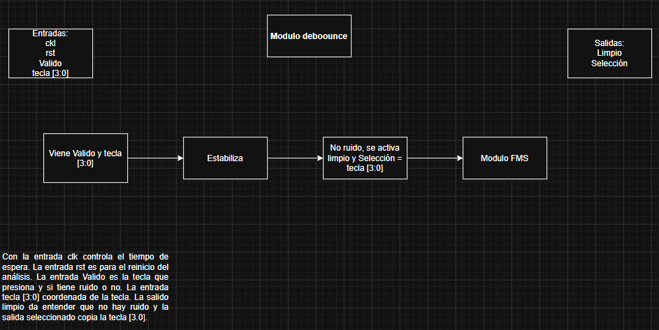
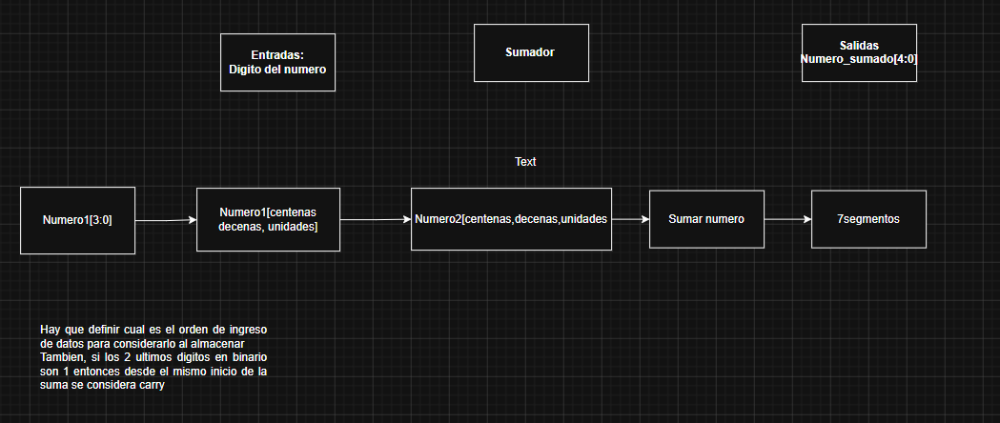
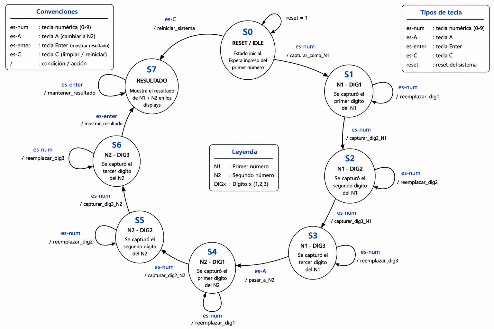

# Proyecto 2
# Sistema de ingreso por teclado matricial hexadecimal

## 1. Funcionamiento general del circuito

El circuito recibe datos desde un teclado matricial hexadecimal de 4x4. La FPGA no recibe directamente el número de la tecla presionada, sino una combinación entre filas y columnas. Por eso, el sistema debe activar columnas una por una y revisar las filas para detectar qué tecla fue presionada.

El sistema permite ingresar un primer número de hasta tres dígitos, luego cambiar al ingreso del segundo número mediante una tecla de control, por ejemplo `A`, y finalmente realizar la operación de suma. El resultado se muestra en displays de 7 segmentos.

El proyecto se divide en módulos: scanner del teclado, limpieza o validación de tecla, FSM de control, captura de números, suma, conversión a dígitos decimales, multiplexado de displays, decodificador de 7 segmentos y módulo superior.

---
## Diagrama de bloques del sistema (etapas tempranas previas a consulta a profesor)
#### Scanner


#### Modulo debounce


#### Sumador


#### Modulo 7segmentos


## Diagrama de transiciones de estados de la FSM



## 2. Módulo `scanner`

### Entradas y salidas

```systemverilog
module scanner (
    input  logic clk,
    input  logic reset,
    input  logic stop_scanning,
    input  logic [3:0] filas,
    output logic [3:0] columnas,
    output logic tecla_detectada,
    output logic [3:0] pos_tecla
);
```

El módulo `scanner` se encarga de leer el teclado matricial. El teclado no entrega directamente el número presionado, sino una conexión entre una fila y una columna.

Por eso, el módulo activa una columna a la vez y revisa si alguna fila cambia de valor. Si una fila cambia, entonces existe una tecla presionada y se puede identificar mediante la combinación `{columnas, filas}`.

### Divisor de reloj y contador de columnas

```systemverilog
logic [14:0] div_clk;
logic [1:0] cuenta_col;

always_ff @(posedge clk or posedge reset) begin
    if (reset) begin
        div_clk <= 0;
        cuenta_col <= 2'b00;
    end else if (!stop_scanning) begin
        if (div_clk == 26999) begin
            div_clk <= 0;
            cuenta_col <= cuenta_col + 1;
        end else begin
            div_clk <= div_clk + 1;
        end
    end
end
```

Esta parte reduce la velocidad del reloj principal. No conviene cambiar de columna a la misma velocidad del reloj de la FPGA, porque el teclado físico necesita un tiempo mínimo para estabilizar sus señales.

El contador `cuenta_col` indica cuál columna está activa en cada momento.

### Activación física de columnas

```systemverilog
always_comb begin
    case (cuenta_col)
        2'b00: columnas = 4'b1110;
        2'b01: columnas = 4'b1101;
        2'b10: columnas = 4'b1011;
        2'b11: columnas = 4'b0111;
        default: columnas = 4'b1111;
    endcase
end
```

Cada valor activa una columna distinta. Como el teclado trabaja con resistencias pull-up, la columna activa se coloca en bajo. Por eso se usan valores como `1110`, `1101`, `1011` y `0111`.

### Mapeo lógico de teclas

```systemverilog
always_comb begin
    tecla_detectada = 1'b0;
    pos_tecla = 4'h0;

    if (filas != 4'b1111) begin
        tecla_detectada = 1'b1;

        case ({columnas, filas})
            8'b1110_1110: pos_tecla = 4'h1;
            8'b1110_1101: pos_tecla = 4'h4;
            8'b1110_1011: pos_tecla = 4'h7;
            8'b1110_0111: pos_tecla = 4'hE; // *

            8'b1101_1110: pos_tecla = 4'h2;
            8'b1101_1101: pos_tecla = 4'h5;
            8'b1101_1011: pos_tecla = 4'h8;
            8'b1101_0111: pos_tecla = 4'h0;

            8'b1011_1110: pos_tecla = 4'h3;
            8'b1011_1101: pos_tecla = 4'h6;
            8'b1011_1011: pos_tecla = 4'h9;
            8'b1011_0111: pos_tecla = 4'hF; // #

            8'b0111_1110: pos_tecla = 4'hA;
            8'b0111_1101: pos_tecla = 4'hB;
            8'b0111_1011: pos_tecla = 4'hC;
            8'b0111_0111: pos_tecla = 4'hD;

            default: pos_tecla = 4'h0;
        endcase
    end
end
```

Esta parte toma la combinación entre columnas y filas para traducirla a una tecla hexadecimal. Si `filas` es distinto de `1111`, significa que hay una tecla presionada.

El módulo no almacena el número ingresado. Solo indica si existe una tecla y cuál fue.

### Testbench del módulo `scanner`

```systemverilog
`timescale 1ns/1ps

module scanner_tb;

    logic clk;
    logic reset;
    logic stop_scanning;
    logic [3:0] filas;
    logic [3:0] columnas;
    logic tecla_detectada;
    logic [3:0] pos_tecla;

    scanner dut (
        .clk(clk),
        .reset(reset),
        .stop_scanning(stop_scanning),
        .filas(filas),
        .columnas(columnas),
        .tecla_detectada(tecla_detectada),
        .pos_tecla(pos_tecla)
    );

    initial begin
        clk = 0;
        forever #5 clk = ~clk;
    end

    initial begin
        reset = 1;
        stop_scanning = 0;
        filas = 4'b1111;
        #20;

        reset = 0;

        // Simulación de una tecla presionada
        #100;
        filas = 4'b1110;
        #100;

        filas = 4'b1111;
        #100;

        $finish;
    end

    initial begin
        $dumpfile("scanner_tb.vcd");
        $dumpvars(0, scanner_tb);
    end

endmodule
```

El testbench genera un reloj artificial y simula el comportamiento de las filas del teclado. Primero se coloca el sistema en reset y luego se libera.

Después se cambia el valor de `filas` para simular una tecla presionada. Con esto se puede observar si el módulo activa correctamente `tecla_detectada` y si `pos_tecla` toma el valor esperado.

---

## 3. Módulo de validación de tecla

### Entradas y salidas

```systemverilog
module tecla_limpia (
    input  logic clk,
    input  logic reset,
    input  logic tecla_v_raw,
    input  logic [3:0] tecla_p_raw,
    output logic pulse_ok,
    output logic [3:0] tecla_ok
);
```

Este módulo recibe la señal cruda del scanner. La señal cruda puede durar muchos ciclos de reloj mientras la tecla está presionada. Si se usa directamente, el sistema puede ingresar el mismo número muchas veces.

La función de este módulo es generar un solo pulso válido por cada pulsación.

### Registro de tecla anterior

```systemverilog
logic tecla_v_prev;

always_ff @(posedge clk or posedge reset) begin
    if (reset) begin
        tecla_v_prev <= 1'b0;
        pulse_ok <= 1'b0;
        tecla_ok <= 4'h0;
    end else begin
        tecla_v_prev <= tecla_v_raw;
        pulse_ok <= 1'b0;

        if (tecla_v_raw && !tecla_v_prev) begin
            pulse_ok <= 1'b1;
            tecla_ok <= tecla_p_raw;
        end
    end
end
```

La lógica compara el estado actual de la tecla con el estado anterior. Si antes no había tecla y ahora sí hay tecla, entonces se genera `pulse_ok`.

Esto evita que una tecla mantenida presionada sea registrada varias veces.

### Testbench del módulo de validación

```systemverilog
`timescale 1ns/1ps

module tecla_limpia_tb;

    logic clk;
    logic reset;
    logic tecla_v_raw;
    logic [3:0] tecla_p_raw;
    logic pulse_ok;
    logic [3:0] tecla_ok;

    tecla_limpia dut (
        .clk(clk),
        .reset(reset),
        .tecla_v_raw(tecla_v_raw),
        .tecla_p_raw(tecla_p_raw),
        .pulse_ok(pulse_ok),
        .tecla_ok(tecla_ok)
    );

    initial begin
        clk = 0;
        forever #5 clk = ~clk;
    end

    initial begin
        reset = 1;
        tecla_v_raw = 0;
        tecla_p_raw = 4'h0;
        #20;

        reset = 0;

        // Presionar tecla 5
        tecla_p_raw = 4'h5;
        tecla_v_raw = 1;
        #50;

        // Mantener presionada
        tecla_v_raw = 1;
        #50;

        // Soltar
        tecla_v_raw = 0;
        #30;

        // Presionar tecla 9
        tecla_p_raw = 4'h9;
        tecla_v_raw = 1;
        #50;

        tecla_v_raw = 0;
        #20;

        $finish;
    end

endmodule
```

Este banco de pruebas verifica que una tecla mantenida presionada no genere varios pulsos. Al presionar `5`, `pulse_ok` debe activarse una sola vez. Aunque la tecla siga presionada, no debe volver a capturarse.

---

## 4. Módulo FSM de control

### Entradas y salidas

```systemverilog
module fsm_control (
    input  logic clk,
    input  logic reset,
    input  logic pulse_ok,
    input  logic [3:0] tecla_ok,
    output logic captura_n1,
    output logic captura_n2,
    output logic limpiar,
    output logic mostrar_resultado
);
```

La FSM controla en qué etapa está el sistema. Primero permite ingresar el primer número. Luego, cuando se presiona la tecla `A`, cambia al ingreso del segundo número. Después puede pasar al estado de resultado.

### Declaración de estados

```systemverilog
typedef enum logic [1:0] {
    INGRESA_N1,
    INGRESA_N2,
    RESULTADO
} estado_t;

estado_t estado_actual, estado_siguiente;
```

Los estados representan las etapas principales del sistema.

### Registro de estado

```systemverilog
always_ff @(posedge clk or posedge reset) begin
    if (reset)
        estado_actual <= INGRESA_N1;
    else
        estado_actual <= estado_siguiente;
end
```

En reset, el sistema vuelve al ingreso del primer número.

### Lógica de transición

```systemverilog
always_comb begin
    estado_siguiente = estado_actual;

    case (estado_actual)
        INGRESA_N1: begin
            if (pulse_ok && tecla_ok == 4'hA)
                estado_siguiente = INGRESA_N2;
        end

        INGRESA_N2: begin
            if (pulse_ok && tecla_ok == 4'hF)
                estado_siguiente = RESULTADO;
        end

        RESULTADO: begin
            if (pulse_ok && tecla_ok == 4'hE)
                estado_siguiente = INGRESA_N1;
        end
    endcase
end
```

La tecla `A` cambia del primer número al segundo. La tecla `F` puede usarse para mostrar el resultado. La tecla `E` puede usarse como limpieza o reinicio lógico.

### Lógica de salidas

```systemverilog
always_comb begin
    captura_n1 = 1'b0;
    captura_n2 = 1'b0;
    limpiar = 1'b0;
    mostrar_resultado = 1'b0;

    case (estado_actual)
        INGRESA_N1: begin
            if (pulse_ok && tecla_ok <= 4'd9)
                captura_n1 = 1'b1;
        end

        INGRESA_N2: begin
            if (pulse_ok && tecla_ok <= 4'd9)
                captura_n2 = 1'b1;
        end

        RESULTADO: begin
            mostrar_resultado = 1'b1;
        end
    endcase

    if (pulse_ok && tecla_ok == 4'hE)
        limpiar = 1'b1;
end
```

La FSM solo permite capturar números del `0` al `9`. Las teclas especiales se usan para control.

### Testbench de la FSM

```systemverilog
`timescale 1ns/1ps

module fsm_control_tb;

    logic clk;
    logic reset;
    logic pulse_ok;
    logic [3:0] tecla_ok;
    logic captura_n1;
    logic captura_n2;
    logic limpiar;
    logic mostrar_resultado;

    fsm_control dut (
        .clk(clk),
        .reset(reset),
        .pulse_ok(pulse_ok),
        .tecla_ok(tecla_ok),
        .captura_n1(captura_n1),
        .captura_n2(captura_n2),
        .limpiar(limpiar),
        .mostrar_resultado(mostrar_resultado)
    );

    initial begin
        clk = 0;
        forever #5 clk = ~clk;
    end

    task presionar(input [3:0] tecla);
        begin
            tecla_ok = tecla;
            pulse_ok = 1;
            #10;
            pulse_ok = 0;
            #10;
        end
    endtask

    initial begin
        reset = 1;
        pulse_ok = 0;
        tecla_ok = 0;
        #20;

        reset = 0;

        presionar(4'd1);
        presionar(4'd2);
        presionar(4'hA);
        presionar(4'd3);
        presionar(4'd4);
        presionar(4'hF);

        $finish;
    end

endmodule
```

El testbench simula la entrada de teclas. Primero se ingresan números para `n1`, luego se presiona `A`, después se ingresan números para `n2` y finalmente se presiona `F` para pasar al resultado.

---

## 5. Módulo de captura de número

### Entradas y salidas

```systemverilog
module captura_numero (
    input  logic clk,
    input  logic reset,
    input  logic habilitar,
    input  logic limpiar,
    input  logic [3:0] digito,
    output logic [13:0] numero,
    output logic [1:0] contador
);
```

Este módulo almacena un número de hasta tres dígitos. Cada vez que `habilitar` está en alto, el módulo agrega el nuevo dígito al número.

### Lógica de captura

```systemverilog
always_ff @(posedge clk or posedge reset) begin
    if (reset || limpiar) begin
        numero <= 14'd0;
        contador <= 2'd0;
    end else if (habilitar && contador < 3) begin
        numero <= (numero * 10) + digito;
        contador <= contador + 1;
    end
end
```

La operación usada es:

```text
nuevo_numero = numero_actual * 10 + digito
```

Por ejemplo:

```text
1      → 1
1, 9   → 19
1,9,9  → 199
```

El contador evita que se ingresen más de tres dígitos.

### Testbench del capturador

```systemverilog
`timescale 1ns/1ps

module captura_numero_tb;

    logic clk;
    logic reset;
    logic habilitar;
    logic limpiar;
    logic [3:0] digito;
    logic [13:0] numero;
    logic [1:0] contador;

    captura_numero dut (
        .clk(clk),
        .reset(reset),
        .habilitar(habilitar),
        .limpiar(limpiar),
        .digito(digito),
        .numero(numero),
        .contador(contador)
    );

    initial begin
        clk = 0;
        forever #5 clk = ~clk;
    end

    task ingresar(input [3:0] d);
        begin
            digito = d;
            habilitar = 1;
            #10;
            habilitar = 0;
            #10;
        end
    endtask

    initial begin
        reset = 1;
        limpiar = 0;
        habilitar = 0;
        digito = 0;
        #20;

        reset = 0;

        ingresar(4'd1);
        ingresar(4'd9);
        ingresar(4'd9);

        #20;
        $display("numero = %0d", numero);

        $finish;
    end

endmodule
```

El testbench ingresa los dígitos `1`, `9` y `9`. Al final, la salida `numero` debe valer `199`.

---

## 6. Módulo sumador

### Entradas y salidas

```systemverilog
module sumador (
    input  logic [13:0] n1,
    input  logic [13:0] n2,
    output logic [14:0] resultado
);
```

El módulo sumador recibe los dos números ingresados desde el teclado y entrega la suma.

### Código del sumador

```systemverilog
assign resultado = n1 + n2;
```

El módulo es combinacional. No necesita reloj porque la salida depende directamente de las entradas.

### Testbench del sumador

```systemverilog
`timescale 1ns/1ps

module sumador_tb;

    logic [13:0] n1;
    logic [13:0] n2;
    logic [14:0] resultado;

    sumador dut (
        .n1(n1),
        .n2(n2),
        .resultado(resultado)
    );

    initial begin
        n1 = 14'd123;
        n2 = 14'd456;
        #10;
        $display("%0d + %0d = %0d", n1, n2, resultado);

        n1 = 14'd999;
        n2 = 14'd999;
        #10;
        $display("%0d + %0d = %0d", n1, n2, resultado);

        $finish;
    end

endmodule
```

El testbench comprueba dos casos. El primero verifica una suma común. El segundo verifica el caso máximo esperado, `999 + 999 = 1998`.

---

## 7. Módulo conversor binario a BCD

### Entradas y salidas

```systemverilog
module bin_to_bcd (
    input  logic [14:0] bin,
    output logic [3:0] miles,
    output logic [3:0] centenas,
    output logic [3:0] decenas,
    output logic [3:0] unidades
);
```

Este módulo separa el número binario en dígitos decimales para poder mostrarlo en displays de 7 segmentos.

### Código de conversión

```systemverilog
always_comb begin
    miles    = bin / 1000;
    centenas = (bin % 1000) / 100;
    decenas  = (bin % 100) / 10;
    unidades = bin % 10;
end
```

Por ejemplo, si `bin = 1998`, entonces:

```text
miles    = 1
centenas = 9
decenas  = 9
unidades = 8
```

### Testbench del conversor BCD

```systemverilog
`timescale 1ns/1ps

module bin_to_bcd_tb;

    logic [14:0] bin;
    logic [3:0] miles;
    logic [3:0] centenas;
    logic [3:0] decenas;
    logic [3:0] unidades;

    bin_to_bcd dut (
        .bin(bin),
        .miles(miles),
        .centenas(centenas),
        .decenas(decenas),
        .unidades(unidades)
    );

    initial begin
        bin = 15'd0;
        #10;
        $display("%0d -> %0d%0d%0d%0d", bin, miles, centenas, decenas, unidades);

        bin = 15'd1998;
        #10;
        $display("%0d -> %0d%0d%0d%0d", bin, miles, centenas, decenas, unidades);

        bin = 15'd579;
        #10;
        $display("%0d -> %0d%0d%0d%0d", bin, miles, centenas, decenas, unidades);

        $finish;
    end

endmodule
```

El testbench revisa que el número binario se separe correctamente en unidades, decenas, centenas y miles.

---

## 8. Módulo decodificador de 7 segmentos

### Entradas y salidas

```systemverilog
module sevenseg_decoder (
    input  logic [3:0] digito,
    output logic [6:0] siete_seg
);
```

Este módulo recibe un dígito decimal y genera el patrón necesario para encender el display de 7 segmentos.

### Código del decodificador

```systemverilog
always_comb begin
    case (digito)
        4'd0: siete_seg = 7'b1111110;
        4'd1: siete_seg = 7'b0110000;
        4'd2: siete_seg = 7'b1101101;
        4'd3: siete_seg = 7'b1111001;
        4'd4: siete_seg = 7'b0110011;
        4'd5: siete_seg = 7'b1011011;
        4'd6: siete_seg = 7'b1011111;
        4'd7: siete_seg = 7'b1110000;
        4'd8: siete_seg = 7'b1111111;
        4'd9: siete_seg = 7'b1111011;
        default: siete_seg = 7'b0000001;
    endcase
end
```

Cada combinación representa los segmentos que deben encenderse para mostrar un número.

### Testbench del decodificador

```systemverilog
`timescale 1ns/1ps

module sevenseg_decoder_tb;

    logic [3:0] digito;
    logic [6:0] siete_seg;

    sevenseg_decoder dut (
        .digito(digito),
        .siete_seg(siete_seg)
    );

    initial begin
        for (int i = 0; i < 10; i++) begin
            digito = i;
            #10;
            $display("digito=%0d segmentos=%b", digito, siete_seg);
        end

        $finish;
    end

endmodule
```

El testbench recorre los dígitos del 0 al 9 y muestra el patrón generado para cada uno.

---

## 9. Módulo multiplexor de displays

### Entradas y salidas

```systemverilog
module display_mux (
    input  logic clk,
    input  logic reset,
    input  logic [3:0] miles,
    input  logic [3:0] centenas,
    input  logic [3:0] decenas,
    input  logic [3:0] unidades,
    output logic [3:0] anodos,
    output logic [3:0] digito_actual
);
```

Este módulo selecciona qué display se activa y qué dígito se muestra. Como los displays se multiplexan, se enciende uno a la vez a alta velocidad.

### Contador de refresco

```systemverilog
logic [15:0] refresh;
logic [1:0] sel;

always_ff @(posedge clk or posedge reset) begin
    if (reset)
        refresh <= 0;
    else
        refresh <= refresh + 1;
end

assign sel = refresh[15:14];
```

El contador genera una selección lenta para alternar entre los displays.

### Selección de ánodo y dígito

```systemverilog
always_comb begin
    case (sel)
        2'b00: begin
            anodos = 4'b1110;
            digito_actual = unidades;
        end

        2'b01: begin
            anodos = 4'b1101;
            digito_actual = decenas;
        end

        2'b10: begin
            anodos = 4'b1011;
            digito_actual = centenas;
        end

        2'b11: begin
            anodos = 4'b0111;
            digito_actual = miles;
        end
    endcase
end
```

El módulo activa un display y entrega el dígito correspondiente. Aunque se activa uno a la vez, la velocidad hace que el usuario vea todos encendidos.

### Testbench del multiplexor

```systemverilog
`timescale 1ns/1ps

module display_mux_tb;

    logic clk;
    logic reset;
    logic [3:0] miles;
    logic [3:0] centenas;
    logic [3:0] decenas;
    logic [3:0] unidades;
    logic [3:0] anodos;
    logic [3:0] digito_actual;

    display_mux dut (
        .clk(clk),
        .reset(reset),
        .miles(miles),
        .centenas(centenas),
        .decenas(decenas),
        .unidades(unidades),
        .anodos(anodos),
        .digito_actual(digito_actual)
    );

    initial begin
        clk = 0;
        forever #5 clk = ~clk;
    end

    initial begin
        reset = 1;
        miles = 4'd1;
        centenas = 4'd9;
        decenas = 4'd9;
        unidades = 4'd8;
        #20;

        reset = 0;
        #1000;

        $finish;
    end

endmodule
```

El testbench carga el número `1998` separado en dígitos y permite observar cómo el multiplexor va seleccionando cada display.

---

## 10. Módulo superior `top`

### Entradas y salidas

```systemverilog
module top (
    input  logic clk,
    input  logic reset,
    input  logic [3:0] filas,
    output logic [3:0] columnas,
    output logic [3:0] anodos,
    output logic [6:0] siete_seg,

    output logic led_externo_contacto,
    output logic led_externo_pulso,
    output logic led_externo_bit0
);
```

El módulo `top` une todos los módulos del sistema. Aquí se declaran las entradas y salidas físicas de la FPGA.

### Señales internas

```systemverilog
logic rst_high;

logic tecla_v_raw;
logic [3:0] tecla_p_raw;

logic pulse_ok;
logic [3:0] tecla_ok;

logic captura_n1;
logic captura_n2;
logic limpiar;
logic mostrar_resultado;

logic [13:0] n1_bin;
logic [13:0] n2_bin;
logic [14:0] suma_res;

logic [3:0] miles;
logic [3:0] centenas;
logic [3:0] decenas;
logic [3:0] unidades;

logic [3:0] digito_actual;

assign rst_high = ~reset;
```

Estas señales conectan un módulo con otro. El `top` no debe concentrar toda la lógica, sino organizar el sistema.

### Instancia del scanner

```systemverilog
scanner u_scanner (
    .clk(clk),
    .reset(rst_high),
    .stop_scanning(1'b0),
    .filas(filas),
    .columnas(columnas),
    .tecla_detectada(tecla_v_raw),
    .pos_tecla(tecla_p_raw)
);
```

El scanner lee el teclado físico y entrega la tecla cruda detectada.

### Instancia del limpiador de tecla

```systemverilog
tecla_limpia u_tecla_limpia (
    .clk(clk),
    .reset(rst_high),
    .tecla_v_raw(tecla_v_raw),
    .tecla_p_raw(tecla_p_raw),
    .pulse_ok(pulse_ok),
    .tecla_ok(tecla_ok)
);
```

Este bloque convierte la detección cruda en un pulso válido.

### Instancia de la FSM

```systemverilog
fsm_control u_fsm (
    .clk(clk),
    .reset(rst_high),
    .pulse_ok(pulse_ok),
    .tecla_ok(tecla_ok),
    .captura_n1(captura_n1),
    .captura_n2(captura_n2),
    .limpiar(limpiar),
    .mostrar_resultado(mostrar_resultado)
);
```

La FSM decide si el dígito debe ir al primer número, al segundo número o si debe mostrarse el resultado.

### Captura del primer número

```systemverilog
captura_numero u_cap_n1 (
    .clk(clk),
    .reset(rst_high),
    .habilitar(captura_n1),
    .limpiar(limpiar),
    .digito(tecla_ok),
    .numero(n1_bin),
    .contador()
);
```

Este bloque almacena el primer número ingresado.

### Captura del segundo número

```systemverilog
captura_numero u_cap_n2 (
    .clk(clk),
    .reset(rst_high),
    .habilitar(captura_n2),
    .limpiar(limpiar),
    .digito(tecla_ok),
    .numero(n2_bin),
    .contador()
);
```

Este bloque almacena el segundo número ingresado.

### Instancia del sumador

```systemverilog
sumador u_sumador (
    .n1(n1_bin),
    .n2(n2_bin),
    .resultado(suma_res)
);
```

El sumador toma ambos números y genera el resultado.

### Conversión a BCD

```systemverilog
bin_to_bcd u_bcd (
    .bin(suma_res),
    .miles(miles),
    .centenas(centenas),
    .decenas(decenas),
    .unidades(unidades)
);
```

Este módulo separa el resultado en dígitos decimales.

### Multiplexor de displays

```systemverilog
display_mux u_mux (
    .clk(clk),
    .reset(rst_high),
    .miles(miles),
    .centenas(centenas),
    .decenas(decenas),
    .unidades(unidades),
    .anodos(anodos),
    .digito_actual(digito_actual)
);
```

Este módulo selecciona qué display se activa y qué dígito se muestra.

### Decodificador de 7 segmentos

```systemverilog
sevenseg_decoder u_decoder (
    .digito(digito_actual),
    .siete_seg(siete_seg)
);
```

Este módulo convierte el dígito actual al patrón del display.

### LEDs de depuración

```systemverilog
assign led_externo_contacto = tecla_v_raw;
assign led_externo_pulso    = pulse_ok;
assign led_externo_bit0     = tecla_ok[0];
```

Los LEDs permiten observar señales internas durante pruebas físicas.
Por referir un uso se usaron como sistema de deteccion de pulso por parte del teclado hexadecimal para comprobar su funcionamiento al ser de prestamo.
Asi tambien en fases posteriores se usaron para iluminarse para representar un 3,2,1 en caso de que se prescione esa tecla como forma de ver ya no solo que el teclado envia la señal sino que el numero que maneja internamente es el adecuado  

### Testbench del módulo `top`

```systemverilog
`timescale 1ns/1ps

module top_tb;

    logic clk;
    logic reset;
    logic [3:0] filas;
    logic [3:0] columnas;
    logic [3:0] anodos;
    logic [6:0] siete_seg;

    logic led_externo_contacto;
    logic led_externo_pulso;
    logic led_externo_bit0;

    top dut (
        .clk(clk),
        .reset(reset),
        .filas(filas),
        .columnas(columnas),
        .anodos(anodos),
        .siete_seg(siete_seg),
        .led_externo_contacto(led_externo_contacto),
        .led_externo_pulso(led_externo_pulso),
        .led_externo_bit0(led_externo_bit0)
    );

    initial begin
        clk = 0;
        forever #5 clk = ~clk;
    end

    initial begin
        reset = 0;
        filas = 4'b1111;
        #30;

        reset = 1;

        // Simulación general de teclas
        // En una prueba real se deben sincronizar filas con columnas.
        #100;
        filas = 4'b1110;
        #100;
        filas = 4'b1111;

        #100;
        filas = 4'b1101;
        #100;
        filas = 4'b1111;

        #500;

        $finish;
    end

    initial begin
        $dumpfile("top_tb.vcd");
        $dumpvars(0, top_tb);
    end

endmodule
```

El testbench del `top` permite observar el comportamiento general del sistema. La simulación del teclado completo requiere coordinar el valor de `filas` con la columna que esté activa en ese momento. Por eso, este banco de pruebas sirve como base para revisar señales principales, pero las pruebas más precisas deben hacerse módulo por módulo.

---

## 11. Ejercicios

En este apartado, se realizarán dos ejercicios sobre dos circuitos, el primero es sobre contadores sincrónicos y el segundo es un cerrojo Set-Reset con compuertas NAND.


## Contadores sincrónicos
 El 74LS163 es un contador cargable sincrónico de 4 bits, con un reset sincrónico. Entonces se toma la siguiente imagen para armar el circuito:


<p align="center">

</p>
<p align="center">
Fig 1. Contadores sincrónicos en cascada.
</p>

Lo primero que se hará es una simulación en multisim para verificar cual es la respueta que se está buscando y cual es el comportamiento de las ondas, para luego compararlo con la respuesta final obtenida en el osciloscopio.

### Simulación

En la siguiente imagen, se muestra como se implemento el circuito en multisim: 

<p align="center">

</p>
<p align="center">
Fig 2. Circuito de contadores sincrónicos en cascada en multisim.
</p>

En est caso se usa unos modelos de 74LS163 que no son necesarios conectarlos una fuente de alimentación y tierra para más comodidad en el simulador, como también poner el reloj en $1\mathrm{kHz}$
(en práctica si debe tomar en cuenta). El primer canal D0, tomará la señal del reloj, el segundo canal D1 sería la salida de QD del primer 74LS163, el tercer canal D2 sería la salida del QD del segundo 74LS163 y el cuarto canal D3 sería RCO del primer 74LS163. En la siguiente imagen se obtiene el resultado obtenido de la simulación:

<p align="center">

</p>
<p align="center">
Fig 3. Resultado del circuito de contadores sincrónicos en cascada en multisim.
</p>

Luego se explicará porque estos comportamientos son coherentes y es lo que se está buscando.

### Resultado obtenido en el Osciloscopio.

En la siguiente imagen se muestra lo que se obtuvo oscilospocio, donde los canales son los mismos que utilizaron en la simulación:

<p align="center">

</p>
<p align="center">
Fig 4. Resultado obtenido del osciloscopio del circuito de contadores sincrónicos en cascada.
</p>

En la señal del Reloj (D0) es una onda cuadrada periodica que está aproximadamente de $1.79\mathrm{MHz}$, un valor cercano al que estaba solicitando.

La señal de salida QD del primer contador (D1), presenta una frencuancia de $114.3\mathrm{kHz}$. Cumple con el funcionamiento del 74LS163, ya que cada salida divide progresivamente la frecuencia de entrada entre potencias de dos [1].

$$
f = \frac{f_{CLK}}{16}
$$ 

$$
f = \frac{1.79\mathrm{MHz}}{16}
$$ 

$$
f = 112\mathrm{kHz}
$$

Cercano al valor obtenido en el osciloscopio.

La señal de salida de QD del segundo contador (D2) es más lenta que del primer contador, esto se debe porque este contador va a incremnetar cuando el primer contador alcance $1111_2$ y la señal RCO habilite la entrada T, por lo que el segundo contador divide nuevamente la frecuencia, produciendo una señal considerablemente más lenta [1].

Por último la señal RCO del primer contador (D3), tiene pulsos estrechos, porque se debe que se actica cuando el contador alcance $1111_2$ y las entradas de habilitación estén activas [1]. El 74LS163 incorpora lógica de carry look-ahead, que permite implementar conteos síncronicos de alta velocidad y evitando retardos acumulativos [1].

La razón de porque el RCO y T están conectados entre los dos contadores es para implementar una conexión en cascada entres ambos dipositivos [1]. Una expliación de como funciona que el primer contador incrementa su valor con cada flanco positivo del reloj, cuando alcanza $1111_2$, la salida RCO se activa, por lo habilita temporalmente la entrada T del segundo contador y en el siguinete flanco positivo del reloj, en el segundo contador imcrementa.

Si observamos la hoja de datos del 74LS163, tiene 2 entradas que serían T (ENT) y P (ENP) [1]. Lo que realiza la entreda P es habilitar el conteo interno del contador, para que eso pase debe estar en un nivel alto [2]. Para la entrada E que aparte de hablitar el conteo, también controla la generación de la señal RCO y por está razón se utiliza para la conexión en cascada entre los dos contadores [1].

Para saber que uno de los flip-flops cambie, luego de un flanco positivo del reloj correponde al tiempo de propagación entre el flanco positivo del reloj y el cambio de estados de las salidas Q [1]. En la hoja de datos del 74LS163, su tiempo de progación del reloj es de una aproximación de $14\mathrm{ns}$ [1]. Este retardo se se puede debe a capacitacias parásitas, frecuancia de operción y carga conectada al circuito [3].

Por ultimo, se debe tomar la importacia de cuál bit de salida se escoja para el osciloscopio, porque cada una posee una frecuencia distinta, en la hoja de datos dice que QD es la frecuencia más baja [1]. Por eso en este caso si utliza QD para facilitar la observación temporal de la señales.


## Cerrojo Set-Reset con compuertas NAND 

Este circuito corresponde un cerrojo SR sincronizado mendiante una señal de reloj y constituido con compuestas NAND. Este tipo de circuitos secuenciales tiene la capacidad de almacenar un bit de información utilizando realimentación entre las compuertas lógicas [4]. Se divide en dos etapas: 1. Habilitación mediante reloj. 2. Etapa de memoria.

En la etapa de habilitación de reloj esta conformada por 2 NAND que recibe las señales de entradas S R y el reloj (CLK), sus salidas se pueden definir:

$$
X = (S \cdot CLK)'
$$

$$
Y = (R \cdot CLK)'
$$

En el caso que reloj este en bajo las salidas tomarán un valor alto, entonces el latch se bloequea y conserva el estado almacenado previamente sin importar los cambios de las entradas S y R [5]. En el  caso que el reloj este en alto, las entradas pueden modificar el estado del lacth [5].

En la etapa de memoria también hay 2 compuertas NAND están conectadas en  realimentación cruzada:

$$
Q = \overline{X \cdot\overline{Q}}
$$

$$
\overline{Q}  = \overline{Y\cdot Q}
$$

Esta realimentación permite que el circuito conserve el último estado almacenado aun cuando las entradas regresen a cero [5]. 

Si está en el caso que $S = 1$ , $R = 0$ y $CLK = 1$, es el estado de SET por lo que $Q = 1$ y $\overline{Q} = 0$.

Si está en el caso que $S = 0$ , $R = 0$ y $CLK = 1$, es el estado de HOLD por lo que $Q = 1$ y $\overline{Q} = 0$. Donde las salidas mantienen el mismo valor previo.

Si está en el caso que $S = 0$ , $R = 1$ y $CLK = 1$, es el estado de RESET por lo que $Q = 0$ y $\overline{Q} = 1$.

Si está en el caso que $S = 1$ , $R = 1$ y $CLK = 1$, es el estado de inválido por lo que $Q = 1$ y $\overline{Q} = 1$. Se concidera inválido porque puede generar resultados impredecibles por los retardos internos de propagación [6]. 

Se toma la siguiente imagen para armar el circuito:

<p align="center">

</p>
<p align="center">
Fig 5. Circuito de prueba de un cerrojo SR.
</p>

Se hará lo mismo que el ejericio anterior, una simulación en multisim para verificar cual es la respueta que se está buscando y cual es el comportamiento de las ondas, para luego compararlo con la respuesta final obtenida en el osciloscopio y también ver si cumple con la teoría antes establecida.

### Simulación

En la siguiente imagen, se mostrar como se implemento el circuito en multisim: 

<p align="center">

</p>
<p align="center">
Fig 6. Circuito de prueba de un cerrojo SR en multisim. 
</p>

En este caso en el simulador se está utilizando un 74LS00D al no tener un 74CHOO en el simulador, sin embargo es una opción alternativa al tener las mismas funciones. También se utiliza un reloj en $1\mathrm{kHz}$ para más comodidad. El primer canal D0 tomará la señal del reloj, el segundo canal D1 tomará la señal de $S$, el tercer canal D2 será $R$, el cuarto canal D3 sera la salida de $Q$ y el quinto canal D4 será la salida de $\overline{Q}$. 

En la siguientes imagenes se observarán los resultados de cada caso en la simulación:

Caso $S = 1$ y $R = 0$:

<p align="center">

</p>
<p align="center">
Fig 7. Resultado de la simulación del cerrojo de S = 1 y R = 0.
</p>


Caso $S = 0$ y $R = 0$:

<p align="center">

</p>
<p align="center">
Fig 8. Resultado de la simulación del cerrojo de S = 0 y R = 0.
</p>


Caso $S = 0$ y $R = 1$:

<p align="center">

</p>
<p align="center">
Fig 9. Resultado de la simulación del cerrojo de S = 0 y R = 1.
</p>


Caso $S = 1$ y $R = 1$:

<p align="center">

</p>
<p align="center">
Fig 9. Resultado de la simulación del cerrojo de S = 1 y R = 1.
</p>

### Resultado obtenido en el Osciloscopio.

En la siguienteS imagenes se muestra lo que se obtuvo oscilospocio, donde los canales son los mismos que utilizaron en la simulación:

Caso $S = 1$ y $R = 0$:

<p align="center">

</p>
<p align="center">
Fig 10. Resultado del osciloscopio del cerrojo de S = 1 y R = 0.
</p>


Caso $S = 0$ y $R = 0$:

<p align="center">

</p>
<p align="center">
Fig 11. Resultado del osciloscopio del cerrojo de S = 0 y R = 0.
</p>

Caso $S = 0$ y $R = 1$:

<p align="center">
 
</p>
<p align="center">
Fig 12. Resultado del osciloscopio del cerrojo de S = 0 y R = 1.
</p>

Caso $S = 1$ y $R = 1$:

<p align="center">

</p>
<p align="center">
Fig 9. Resultado del osciloscopio del cerrojo de S = 1 y R = 1.
</p>

Como puede observar los resultados cumplen lo establecido anteriormente y también es similar a lo obtenido en la simulación.

Su tabla de verdad es la siguiente:

<p align="center">
Tabla 1. Tabla de verdad del cerrojo.
</p>

<p align="center">

</p>


## 12. Problemas encontrados durante el proyecto

Uno de los problemas principales fue entender que el teclado no entrega directamente el valor de la tecla. El teclado solo conecta una fila con una columna, por lo que fue necesario implementar un scanner que active columnas y revise filas.

También se tuvo dificultad con las capturas repetidas. Si se usa directamente la señal del scanner, una sola pulsación puede entrar varias veces. Para resolver esto se agregó un módulo que genera un solo pulso válido por tecla.

Otro punto delicado fue la FSM. El sistema debe saber si el dígito ingresado pertenece al primer número o al segundo. Para eso se utilizó una tecla de control, como `A`, que cambia el estado del sistema.

La captura de tres dígitos también necesitó cuidado. El número no se puede guardar como teclas separadas sin procesar, sino que debe construirse con la operación `numero * 10 + digito`.

En el módulo superior, el problema más común fue conectar señales equivocadas. Por ejemplo, usar la tecla cruda en lugar de la tecla validada puede hacer que el sistema detecte la tecla pero la almacene mal.

## Consumo de recursos 

### Estadísticas de síntesis del módulo `top`

| Recurso | Cantidad |
|---|---:|
| Number of wires | 1168 |
| Number of wire bits | 2278 |
| Number of public wires | 1168 |
| Number of public wire bits | 2278 |
| Number of memories | 0 |
| Number of memory bits | 0 |
| Number of processes | 0 |
| Number of cells | 1487 |

### Desglose de celdas

| Celda | Cantidad |
|---|---:|
| ALU | 151 |
| DFFC | 44 |
| DFFCE | 130 |
| DFFP | 1 |
| DFFPE | 1 |
| GND | 1 |
| IBUF | 6 |
| LUT1 | 337 |
| LUT2 | 162 |
| LUT3 | 74 |
| LUT4 | 240 |
| MUX2_LUT5 | 199 |
| MUX2_LUT6 | 78 |
| MUX2_LUT7 | 33 |
| MUX2_LUT8 | 11 |
| OBUF | 18 |
| VCC | 1 |